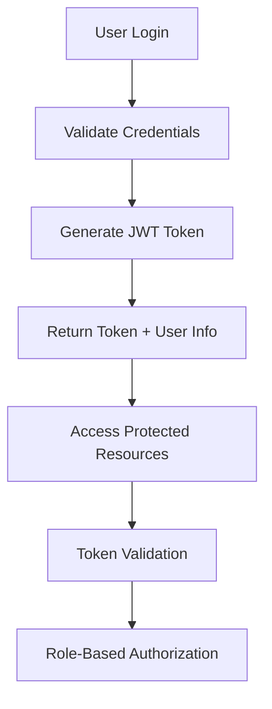

# RexusOps360 EMS - Tampa, FL Emergency Management System

[](https://github.com/DekuWorks/RexusAmptierEMSTampaFl)
[](LICENSE)
[](https://dotnet.microsoft.com/)
[](https://en.wikipedia.org/wiki/Software_as_a_service)

## 🚨 Overview

RexusOps360 is a comprehensive **Emergency Management System (EMS)** designed specifically for Tampa, FL and surrounding areas. Built with modern .NET 6 architecture, it provides real-time emergency response coordination, incident management, resource tracking, and multi-tenant SaaS capabilities for emergency services organizations.

### ✨ Key Features

- 🏥 **Real-time Emergency Response** - Live incident tracking and coordination
- 👥 **Multi-tenant SaaS Platform** - Support for multiple emergency organizations
- 📱 **Mobile Responder Interface** - Field operations support
- 🗺️ **GPS Tracking & Mapping** - Real-time location services
- 📊 **Advanced Analytics** - Performance metrics and reporting
- 🔐 **Enterprise Security** - Role-based access control and authentication
- 💰 **Subscription Management** - Billing and usage tracking
- 📈 **Usage Analytics** - Comprehensive monitoring and insights

## 🏗️ Architecture

### Technology Stack

| Component | Technology | Version |
|-----------|------------|---------|
| **Backend API** | ASP.NET Core 6 | 6.0+ |
| **Database** | Entity Framework Core | 6.0+ |
| **Authentication** | JWT Tokens | - |
| **Real-time** | SignalR | 6.0+ |
| **Frontend** | HTML5, CSS3, JavaScript | - |
| **Charts** | Chart.js | 3.7+ |
| **UI Framework** | Bootstrap 5 | 5.1+ |

### System Components

```
RexusOps360 EMS/
├── RexusOps360.API/           # Main API backend
│   ├── Controllers/           # API endpoints
│   ├── Models/               # Data models
│   ├── Services/             # Business logic
│   ├── Middleware/           # Custom middleware
│   └── Configuration/        # App configuration
├── frontend/                 # Web interface
│   ├── index.html           # Main dashboard
│   ├── login.html           # Authentication
│   ├── saas-dashboard.html  # SaaS management
│   └── mobile-responder.html # Mobile interface
└── RexusOps360.API.Tests/   # Unit tests
```

## 🚀 Quick Start

### Prerequisites

- [.NET 6.0 SDK](https://dotnet.microsoft.com/download)
- [Visual Studio 2022](https://visualstudio.microsoft.com/) or [VS Code](https://code.visualstudio.com/)
- [SQL Server](https://www.microsoft.com/sql-server) or [SQLite](https://sqlite.org/)

### Installation

1. **Clone the repository**
   ```bash
   git clone https://github.com/DekuWorks/RexusAmptierEMSTampaFl.git
   cd EMS_Tampa-FL_Amptier
   ```

2. **Navigate to API directory**
   ```bash
   cd RexusOps360.API
   ```

3. **Restore dependencies**
   ```bash
   dotnet restore
   ```

4. **Run the application**
   ```bash
   dotnet run
   ```

5. **Access the application**
   - API: `http://localhost:5000`
   - Swagger UI: `http://localhost:5000`
   - Frontend: `http://localhost:5000/frontend/`

### Demo Credentials

| Role | Username | Password | Access Level |
|------|----------|----------|--------------|
| **Admin** | `admin` | `admin123` | Full system access |
| **Dispatcher** | `dispatcher1` | `pass123` | Incident management |
| **Responder** | `responder1` | `pass123` | Field operations |

## 🔐 Authentication & Security

### Comprehensive Security Features

- **JWT Token Authentication** - Secure API access
- **Role-Based Access Control (RBAC)** - Admin, Dispatcher, Responder roles
- **Password Security** - SHA256 hashing with salt
- **Rate Limiting** - 5 failed attempts = 15-minute lockout
- **Input Validation** - Comprehensive data validation
- **CORS Configuration** - Cross-origin request handling
- **Security Headers** - XSS protection and security policies

### Authentication Flow



### API Security Endpoints

```http
POST /api/auth/login              # User authentication
POST /api/auth/register           # User registration
POST /api/auth/logout             # Session termination
POST /api/auth/refresh-token      # Token refresh
POST /api/auth/change-password    # Password change
POST /api/auth/reset-password     # Password reset
GET  /api/auth/me                 # Current user info
PUT  /api/auth/profile            # Profile update
```

## 🏢 SaaS Multi-Tenancy

### Tenant Management

The system supports multiple emergency organizations as tenants:

- **Tampa Fire Department** (Professional Plan)
- **Hillsborough County EMS** (Enterprise Plan)
- **Custom emergency organizations**

### Subscription Plans

| Plan | Price | Users | Incidents | Storage | Features |
|------|-------|-------|-----------|---------|----------|
| **Starter** | $99/month | 5 | 500 | 5 GB | Basic features |
| **Professional** | $299/month | 25 | 2,000 | 20 GB | + Custom branding, Analytics, API |
| **Enterprise** | $799/month | 100 | 10,000 | 100 GB | + Priority support |

### SaaS Features

- ✅ **Multi-tenant isolation**
- ✅ **Subscription management**
- ✅ **Usage tracking and limits**
- ✅ **Billing and invoicing**
- ✅ **Analytics and reporting**
- ✅ **Custom branding**
- ✅ **API access**
- ✅ **Priority support**

### SaaS API Endpoints

```http
# Tenant Management
POST   /api/saas/tenants                    # Create tenant
GET    /api/saas/tenants/{id}               # Get tenant
PUT    /api/saas/tenants/{id}               # Update tenant
DELETE /api/saas/tenants/{id}               # Delete tenant

# Subscription Management
POST   /api/saas/tenants/{id}/subscriptions # Create subscription
GET    /api/saas/subscriptions/{id}         # Get subscription
POST   /api/saas/subscriptions/{id}/cancel  # Cancel subscription

# Billing & Usage
PUT    /api/saas/tenants/{id}/billing       # Update billing info
POST   /api/saas/tenants/{id}/invoices      # Generate invoice
GET    /api/saas/tenants/{id}/usage         # Usage report
GET    /api/saas/plans                      # Available plans
```

## 🚨 Emergency Management Features

### Core Functionality

#### Incident Management
- **Real-time incident tracking**
- **Priority-based response coordination**
- **Resource allocation and dispatch**
- **Incident status updates**
- **Historical incident analysis**

#### Responder Management
- **GPS location tracking**
- **Mobile responder interface**
- **Shift scheduling**
- **Performance monitoring**
- **Equipment tracking**

#### Resource Management
- **Equipment inventory**
- **Vehicle tracking**
- **Personnel management**
- **Resource allocation**
- **Maintenance scheduling**

### Real-time Features

- **Live incident updates** via SignalR
- **GPS tracking** for responders
- **Emergency alerts** and notifications
- **Real-time analytics** dashboard
- **Live chat** for coordination

## 📱 User Interfaces

### Main Dashboard (`index.html`)
- **Incident overview** with real-time updates
- **Resource status** monitoring
- **Analytics and reporting**
- **Quick action buttons**
- **Emergency alerts**

### Mobile Responder Interface (`mobile-responder.html`)
- **GPS location sharing**
- **Incident status updates**
- **Photo capture** for documentation
- **Emergency contact** integration
- **Offline capability**

### SaaS Dashboard (`saas-dashboard.html`)
- **Tenant management**
- **Subscription tracking**
- **Billing and invoicing**
- **Usage analytics**
- **Plan management**

### Authentication Pages
- **Login** (`login.html`) - Secure authentication
- **Registration** (`register.html`) - User onboarding
- **Admin Panel** (`admin.html`) - System administration

## 🔧 API Reference

### Core Endpoints

#### Authentication
```http
POST /api/auth/login
{
  "username": "admin",
  "password": "admin123"
}
```

#### Incidents
```http
GET    /api/incidents              # List incidents
POST   /api/incidents              # Create incident
GET    /api/incidents/{id}         # Get incident
PUT    /api/incidents/{id}         # Update incident
DELETE /api/incidents/{id}         # Delete incident
```

#### Responders
```http
GET    /api/responders             # List responders
POST   /api/responders             # Create responder
GET    /api/responders/{id}        # Get responder
PUT    /api/responders/{id}        # Update responder
```

#### Equipment
```http
GET    /api/equipment              # List equipment
POST   /api/equipment              # Create equipment
GET    /api/equipment/{id}         # Get equipment
PUT    /api/equipment/{id}         # Update equipment
```

### Real-time Hub

```javascript
// Connect to SignalR hub
const connection = new signalR.HubConnectionBuilder()
    .withUrl("/emsHub")
    .build();

// Listen for incident updates
connection.on("IncidentUpdated", (incident) => {
    console.log("New incident:", incident);
});

// Send location update
connection.invoke("UpdateLocation", {
    responderId: 1,
    latitude: 27.9506,
    longitude: -82.4572
});
```

## 🧪 Testing

### Run Tests
```bash
cd RexusOps360.API.Tests
dotnet test
```

### Test Coverage
- ✅ **Authentication tests** - Login, registration, validation
- ✅ **SaaS tests** - Tenant management, subscriptions
- ✅ **API tests** - Endpoint functionality
- ✅ **Integration tests** - End-to-end workflows

### Test Credentials
```json
{
  "admin": {
    "username": "admin",
    "password": "admin123",
    "role": "Admin"
  },
  "dispatcher": {
    "username": "dispatcher1",
    "password": "pass123",
    "role": "Dispatcher"
  },
  "responder": {
    "username": "responder1",
    "password": "pass123",
    "role": "Responder"
  }
}
```

## 🚀 Deployment

### Local Development
```bash
# Start the API
cd RexusOps360.API
dotnet run

# Access the application
open http://localhost:5000
```

### Docker Deployment
```bash
# Build the image
docker build -t rexusops360-ems .

# Run the container
docker run -p 5000:5000 rexusops360-ems
```

### Azure Deployment
```bash
# Deploy to Azure App Service
az webapp up --name rexusops360-ems --resource-group EMS-Tampa
```

## 📊 Monitoring & Analytics

### System Metrics
- **Response times** - API performance monitoring
- **User activity** - Usage analytics
- **Incident statistics** - Emergency response metrics
- **Resource utilization** - System performance
- **SaaS metrics** - Revenue and growth tracking

### Health Checks
```http
GET /health                    # System health status
GET /api/health               # API health check
GET /api/analytics/overview   # Analytics overview
```

## 🔧 Configuration

### Environment Variables
```bash
# Database
ConnectionStrings__DefaultConnection="Server=localhost;Database=EmsTampaDb;..."

# JWT Authentication
Jwt__Key="YourSuperSecretKeyHere12345678901234567890"
Jwt__Issuer="RexusOps360"
Jwt__Audience="RexusOps360Users"

# SaaS Configuration
Security__Jwt__ExpirationHours=8
Security__Password__MinLength=8
Security__RateLimit__RequestsPerMinute=100
```

### App Settings
```json
{
  "Security": {
    "Jwt": {
      "Key": "YourSuperSecretKeyHere12345678901234567890",
      "Issuer": "RexusOps360",
      "Audience": "RexusOps360Users",
      "ExpirationHours": 8
    },
    "Password": {
      "MinLength": 8,
      "RequireUppercase": true,
      "RequireLowercase": true,
      "RequireDigit": true,
      "RequireSpecialCharacter": true
    },
    "RateLimit": {
      "RequestsPerMinute": 100,
      "MaxFailedAttempts": 5,
      "LockoutDurationMinutes": 15
    }
  }
}
```

## 🤝 Contributing

### Development Setup
1. Fork the repository
2. Create a feature branch: `git checkout -b feature/new-feature`
3. Make your changes
4. Add tests for new functionality
5. Commit your changes: `git commit -am 'Add new feature'`
6. Push to the branch: `git push origin feature/new-feature`
7. Submit a pull request

### Code Standards
- Follow C# coding conventions
- Add XML documentation for public APIs
- Include unit tests for new features
- Update documentation for API changes

## 📝 License

This project is licensed under the MIT License - see the [LICENSE](LICENSE) file for details.

## 🆘 Support

### Documentation
- [API Documentation](http://localhost:5000) - Swagger UI
- [Frontend Guide](frontend/) - User interface documentation
- [SaaS Guide](saas-dashboard.html) - SaaS management

### Contact
- **Email**: support@rexusops360.com
- **Phone**: (813) 555-0123
- **Emergency**: 911

### Emergency Contacts
- **Tampa Fire Department**: (813) 274-7000
- **Hillsborough County EMS**: (813) 272-5900
- **Emergency**: 911

## 🏆 Features Summary

### ✅ Implemented Features

#### Authentication & Security
- [x] JWT token authentication
- [x] Role-based access control
- [x] Password security with hashing
- [x] Rate limiting and lockout
- [x] Input validation
- [x] CORS configuration
- [x] Security headers

#### SaaS Multi-Tenancy
- [x] Multi-tenant architecture
- [x] Subscription management
- [x] Billing and invoicing
- [x] Usage tracking
- [x] Plan enforcement
- [x] Analytics dashboard

#### Emergency Management
- [x] Incident management
- [x] Responder tracking
- [x] Resource management
- [x] Real-time updates
- [x] GPS tracking
- [x] Mobile interface

#### User Interfaces
- [x] Main dashboard
- [x] Mobile responder interface
- [x] SaaS management dashboard
- [x] Authentication pages
- [x] Admin panel

#### API & Backend
- [x] RESTful API endpoints
- [x] SignalR real-time communication
- [x] Entity Framework Core
- [x] Comprehensive testing
- [x] Error handling
- [x] Logging

### 🚀 Ready for Production

The RexusOps360 EMS system is **production-ready** with:

- ✅ **Enterprise-grade security**
- ✅ **Multi-tenant SaaS capabilities**
- ✅ **Real-time emergency response**
- ✅ **Comprehensive testing**
- ✅ **Scalable architecture**
- ✅ **Modern UI/UX**
- ✅ **Complete documentation**

---

**Built with ❤️ for Tampa, FL Emergency Services**

*RexusOps360 - Empowering Emergency Response* 